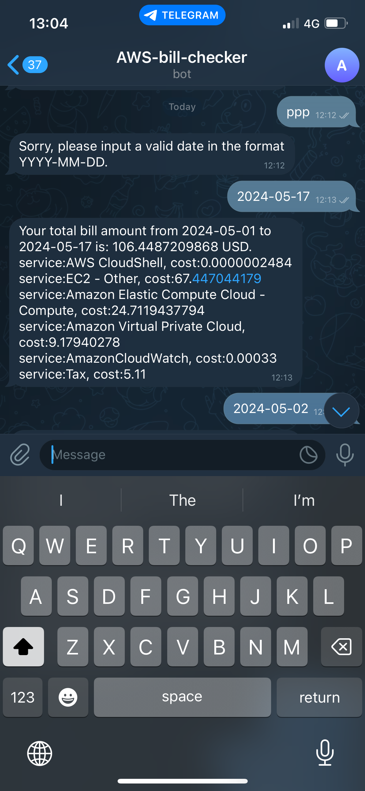
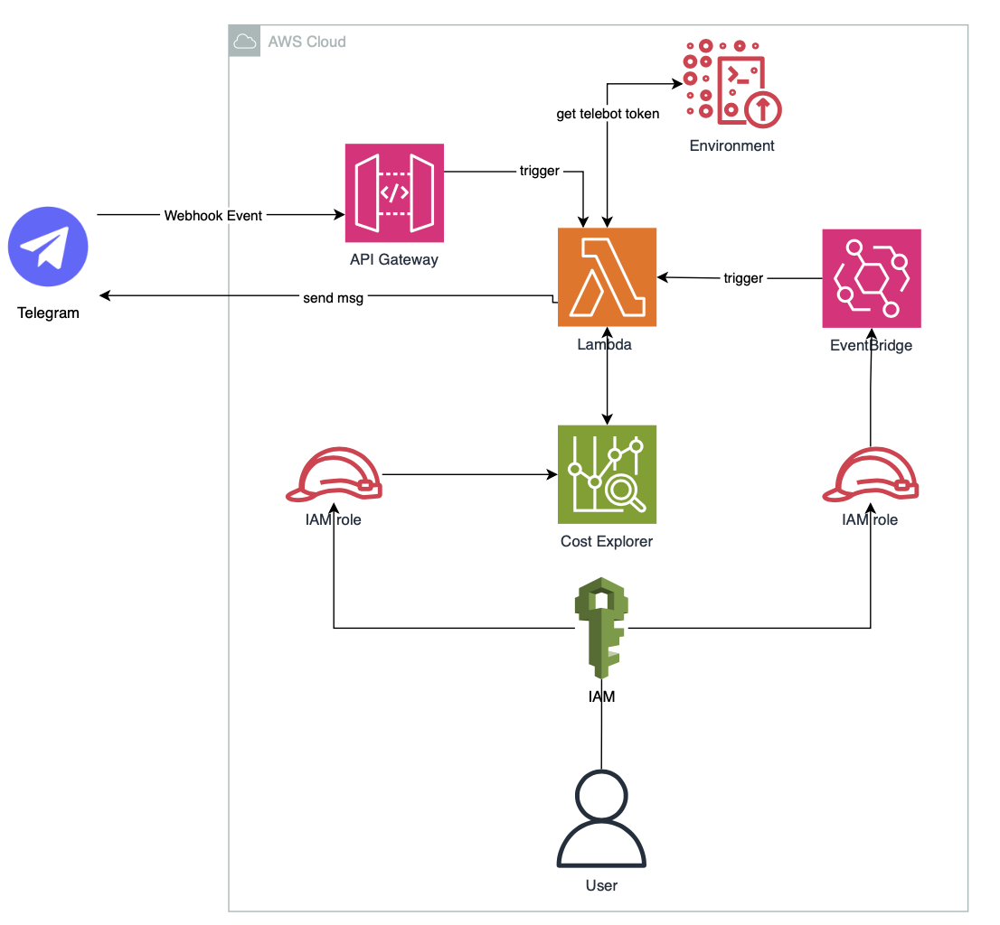
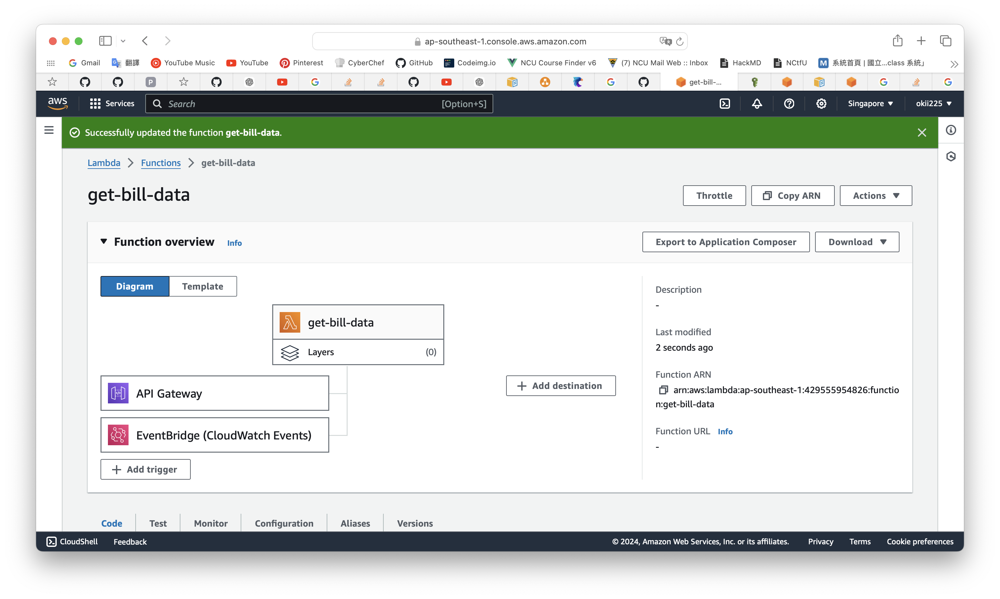
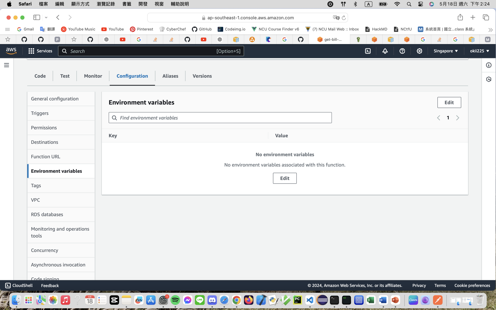

# AWS-bill-bot
This is a simple telebot for asking your AWS bill. The reason for building this bot is that I forgot to delete the NAT gateway, so the bill becomes horrible...

## Screenshot


## Architecture diagram


## Triggers
### Response after asking
The Lambda function could be invoked by API gateway. The API gateway build a path between Telegram and Lambda function.

### Remind everyday
With the EventBridge trigger, the Lambda function get data every day.


## Environment variables
To hide the secret information, such as keys and tokens, from Lambda function, we can set these information as Environment variables.



Then we can use `os` to get these values.

```python
import os
variable = os.environ[<KEY>] # your value
```